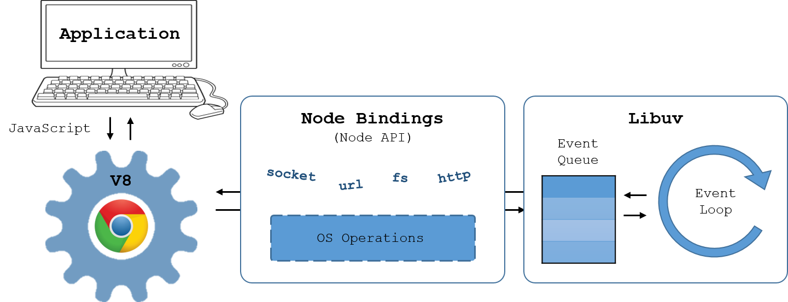
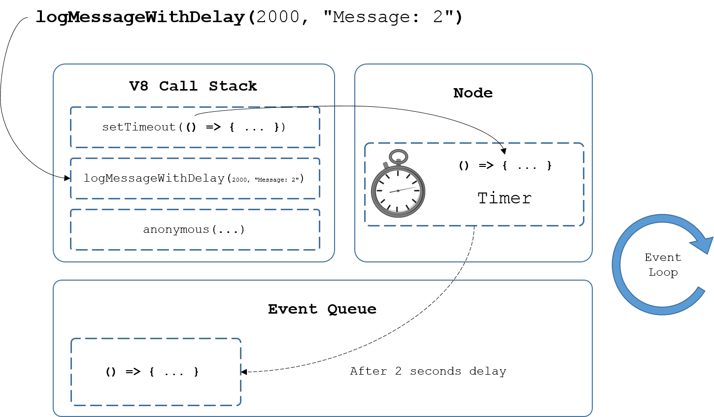

# Node.js dojo
In this tutorial, you will learn the basics of Node and explore its applications in developing scalable network applications.

## Prerequisites

To follow along, you will need to install the following software on your local machine:

* [Node v8](https://nodejs.org/en/) (*which includes [npm](https://www.npmjs.com/get-npm)*)
* [Yarn](https://yarnpkg.com/en/) (*recommended for people in Bath due to proxy issues*)
* [Visual Studio Code](https://code.visualstudio.com/)

The tutorial also assumes:

* you understand basic JavaScript and have an awareness of [ES6](http://es6-features.org) features.
* you are working on Windows OS (*there are slight differences in the implementation of Node on Linux*).

## Setting up your environment

To start, create a directory in which to store the examples you will work with in this tutorial. Open up an instance of Command Prompt and paste the following (*replacing with a suitable directory of your choice if you wish*):

```bash
mkdir ".%HOMEPATH%/Projects/NodeJsDojo"
code ".%HOMEPATH%/Projects/NodeJsDojo"
```

You can press `Ctrl + '` to open up the integrated terminal in Visual Studio Code and use this for our commands. Pressing `Ctrl + \` splits the terminal into multiple sessions, whilst `Ctrl + Shift + '` opens a new terminal in the dropdown terminal list. You can close any unnecessary terminals by entering the command:
```bash
exit
```
More handy shortcuts can be found [here](https://code.visualstudio.com/docs/editor/integrated-terminal).

Now that you're familiar with the terminal in Visual Studio Code, you can check Node has been installed correctly by entering the command:
```bash
node --version
```
You should see a version number in the format of `v8.x.x`

## What actually is Node?

Put simply, Node is a free, open source, cross-platform server environment. It runs in a single thread, and uses non-blocking, asynchronous programming so it can handle multiple requests simultaneously via events. It is fundamentally a JavaScript runtime environment, but is a lot more than just JavaScript - there is also a lot of C++ and C behind the scenes!

Here is a general (simplified) layout of Node's architecture:



Node consists of 3 primary building blocks:
* **[V8](https://developers.google.com/v8/)** - Google's high-performance JavaScript engine, written in C++ and used in Google Chrome. It is effectively a VM that can be used to run JavaScript code. Node uses this by default, but it is possible to configure it to use Microsoft's ChakraCore engine that powers Edge instead (see [here](https://github.com/nodejs/node-chakracore) if you're interested).
* **[Libuv](https://libuv.org/)** - A high performance, cross platform evented I/O library written in C. In Node, an event loop is used to push callbacks to the runtime call stack so that asynchronous responses can be processed - more on this later.
* **[JS, C++](https://nodejs.org/en/docs/meta/topics/dependencies/)** - Other code libraries for HTTP parsing, handling DNS requests, cryptographic functions and file compression/decompression.

Another core part of Node is [npm](https://docs.npmjs.com/), or *node package manager*. Since a key functionality of Node is modularity, npm allows users to publish packages to a registry via a Command Line Interface (CLI) - this will be explored later.

To understand some of these concepts better, it's time to get coding!

## Node CLI and REPL

In the Visual Studio Code terminal, simply entering the command
```bash
node
```
will take you into Node's shell called **REPL**. REPL stands for Read-Eval-Print-Loop and allows you to experiment with Node commands. Entering the command
```bash
> .help
```
lists all of the available commands - try that now. Pressing the `Tab` key twice provides us with a list of available commands / autocomplete options. If you do that on an empty terminal line, you will get the list of properties on the `global` object in Node. Try pressing `Tab` twice after typing the following:
```bash
> var str = "foo";

undefined

> str.
```
Now you will see what is available on the *str* variable. You will also notice that the result of assigning the variable is printed (`undefined` in this case).

Press `Ctrl + C` twice (or `Ctrl + D`) to terminate the Node REPL.

## Running scripts in Node

On the left hand side of Visual Studio Code, create a new file called *custom-repl.js* and paste in the following code:
```javascript
const repl = require('repl');
let r = repl.start({
    ignoreUndefined: true
});
```

Run this script in Node by running the command
```bash
node custom-repl.js
```
in the terminal. The `repl` module allows you to create a custom REPL session. In this case undefined values will not be printed e.g. try assigning a variable as before). More information about starting custom REPL sessions can be found [here](https://nodejs.org/api/repl.html#repl_repl_start_options).

## Introduction to require and modules

Modules allow you to encapsulate related code into a single unit. A module has a 1 to 1 relationship with files on the file system and any module can be "required" by another module that needs it. `require` and `module` are modules themselves and are used for managing module dependencies. The `require` module itself provides the `require()` function used for loading in modules.

Type into the terminal:
```bash
> node -p "module"

Module {
  id: '[eval]',
  exports: {},
  parent: undefined,
  filename: 'C:\\Projects\\NodeJSDojo\\[eval]',
  loaded: false,
  children: [],
  paths:
   [ 'C:\\Projects\\NodeJSDojo\\node_modules',
     'C:\\Projects\\node_modules',
     'C:\\node_modules' ] }
```

The `-p` flag allows Node to evaluate a JavaScript string and print the result. So the above is equivalent to creating a JavaScript file e.g. *index.js* containing `console.log(module)` and running `node index.js`.

You should be able to see the module of the Node process run from the above command. Note that the module has a unique `id`, parent-child relationships to other modules (empty in this case) and a list of paths (since Node allows multiple ways of requiring a file).

You might be wondering where this `module` has come from? It's a property stored on the `global` object.

## The global object in Node

In Node, the top-level scope is not the global scope. In regular JavaScript, `var a = ...` in the top-level scope will define a global variable (not a recommended practice). But in Node, any top-level variables declared in a Node module will be local to that module. To allow for global variables, Node uses the `global` object.

For example, the `process` object on the `global` object allows Node to communicate with its running environment. Try running the following in terminal to see the versions of Node's dependencies:
```bash
> node -p "process.versions"

{ http_parser: '2.7.0',
  node: '8.9.4',
  v8: '6.1.534.50',
  ... }
```

Anything defined on the `global` object is available across all modules e.g. `global.foo = "bar"`. That said, there is an exception to this rule...

## Wrapping modules

There are 5 variables on the `global` object that appear to be global when they are not:

* `__dirname`   - The directory name of the current module
* `__filename`  - The file name of the current module
* `exports`     - A reference to the module.exports that is shorter to type
* `module`      - A reference to the current module
* `require()`   - Used to require modules

This is because when Node compiles a module, it wraps the code in a wrapper function. You can inspect the wrapper function used for a general module by running the following command in the terminal:
```bash
> node -p "require('module').wrapper"

[ '(function (exports, require, module, __filename, __dirname) { ',
  '\n});' ]
```

It should be noted that `exports` is a convenience variable. `module.exports` is returned by `require()`, but `exports` is not. As such, the `exports` object cannot be replaced directly, so:

```javascript
exports.foo = 1;       // okay
module.exports = { foo: 1 };  // okay
exports = { id: 1 };  // not okay
```

Taking a step back, it's important to understand requiring and exporting modules in Node. Let's look at a practical example - a HTTP server.

## A basic HTTP server

Create a folder called "modules" and add the following JavaScript file:
```javascript
// server.js
const server = require('http').createServer();

server.on('request', (req, res) => {
    res.end('Hello world\n');
}).listen(8000);
```

This code snippet creates a basic HTTP server that can accept requests, and respond with "Hello world". Run the server by running `node server.js` in the terminal. If you open up a browser session and visit `http://localhost:8000`, you will see the response printed. To modularize this code, add to the bottom of the code:
```javascript
module.exports = server;
```

Now, in a separate Javascript file add the following code:
```javascript
const server = require('./server');
```

If you run `node modules/main.js` in the terminal, you will be able to access the server in the browser as before in the same way. Notice you didn't need to use the file extension.

Try adding the line
```javascript
console.log(module);
```

to `main.js` and you will see, when running the Node application again, the module has children now (recall that this *module* is an argument of the wrapper function):

```bash
Module {
  id: '.',
  exports: {},
  parent: null,
  filename: 'C:\\Projects\\NodeJSDojo\\modules\\main.js',
  loaded: false,
  children:
   [ Module {
       id: 'C:\\Projects\\NodeJSDojo\\modules\\server.js',
       exports: [Object],
       parent: [Circular],
       filename: 'C:\\Projects\\NodeJSDojo\\modules\\server.js',
       loaded: true,
       children: [],
       paths: [Array] } ],
  paths:
   [ 'C:\\Projects\\NodeJSDojo\\modules\\node_modules',
     'C:\\Projects\\NodeJSDojo\\node_modules',
     'C:\\Projects\\node_modules',
     'C:\\node_modules' ] }
```

## Circular references

You may have noticed above that some of parent of the server module was printed as *[Circular]*. In this case, it is to stop Node recursively printing the same parent-child relationships again and again, but it should be noted that Node does actually support circular dependencies. The *loaded* boolean of the Module describes if all of the code from that module has been run yet - in the previous example, the server code had been fully run whereas the main code had not.

This raises an important question. If not all the code from one module has loaded, then what happens if you create a circular dependency? To explore this, create a `moduleA.js` file with this:

```javascript
// circularModuleA.js
exports.loadedValue = 123;
const mB = require('./circularModuleB');
exports.notLoadedValue = 42;
```

and create the following `circularModuleB.js` file:
```javascript
// circularModuleB.js
const mA = require('./circularModuleA');
console.log(mA.loadedValue);
console.log(mA.notLoadedValue);
```

If you run `node moduleA.js`, you will see that `123` and `undefined` are logged to the console. Node will share a partial exports object to any module that requires in the case of a circular dependencies.

## The event queue, event loop and call stack

Node is described as "*an asynchronous event driven JavaScript runtime*". So far, you've seen one example of a Node event in the server example:

```javascript
server.on('request', (req, res) => {
    res.end('Hello world\n');
}).listen(8000);
```

But how do events like this work in Node? As you saw earlier in the architecture of Node, events are handled by Libuv via an *event loop* and *event queue*. The V8 *call stack* is a [LIFO](https://en.wikipedia.org/wiki/Stack_(abstract_data_type)) list of functions to be executed. The *event queue* contains a list of events with an associated function to be invoked when it is triggered. The job of the *event loop* is to monitor the *call stack* and *event queue* so that, if the *call stack* is empty, and the *event queue* is not, the last function will get pushed from the queue to be invoked in the call stack.

When running an asynchronous function on a timer or waiting on a response, Node uses its API (e.g. timers, emitters, wrappers around OS operations) to handle pushing items on to the *event queue* when needed.

Create a folder called `event-loop` containing the following JavaScript file:
```javascript
// messageLogger.js
const logMessageWithDelay = (delay, msg, callback) => {
    setTimeout(() => {
        console.log(msg);
        if(callback) callback();
    }, delay);
};

for (let i=0; i<5; i++) {
    logMessageWithDelay(i*1000, "Message: ".concat(i));
};
```

Run this in the terminal by running `node event-loop/messageLogger.js` and you should see a message printed every second for 5 seconds. The `setTimeout` function schedules execution of a one-time callback after a delay (in ms). It's important to remember that `setTimeout` is not actually part of V8 - it's an API provided by Node (the browser equivalent is `window.setTimeout` from the JavaScript API). The following diagram describes what happens between the *call stack* and *event queue* as these messages are logged:



As soon as functions are invoked, they are popped off of the call stack. So `setTimeout`, `logMessageWithDelay` and (after the rest of the `logMessageWithDelay` functions have been invoked), `anonymous` are popped off of the *call stack*. When the `setTimeout` API is called, Node instantiates a timer outside of the V8 JavaScript run time which, after completion, pushes the callback to the *event queue*. As soon as the event is in the queue and the *call stack* is empty, the *event loop* on its next iteration will push the callback to the *call stack* to be invoked.

By default, when the *event loop* and *event queue* is empty, Node will exit the process.

## Inside the event loop

Other than `setTimeout`, Node also has the functions `setImmediate` and `setInterval` for scheduling callback execution. Create a new file in the `event-loop` folder with the following code:

```javascript
// setTimeout-vs-setImmediate.js
const fs = require('fs');

setTimeout(() => {
  console.log('timeout 1');
}, 0);

setImmediate(() => {
  console.log('immediate 1');
});

fs.readFile(__filename, () => {
  setTimeout(() => {
    console.log('timeout 2');
  }, 0);
  setImmediate(() => {
    console.log('immediate 2');
  });
});
```

The `readFile` method of the File System (`fs`) module can be used to asynchronously read the entire contents of a file. Recall that `__filename` refers to the file name of the current module.

Which of these do you think will be displayed first?

In this case, `immediate 2` will be logged before `timeout 2`, and the order of `immediate 1` and `timeout 1` is non-deterministic (run a few times and you will see different orders). To understand this, let's investigate the event loop inner workings. The following [diagram from the Node website](https://nodejs.org/en/docs/guides/event-loop-timers-and-nexttick/) gives a simplified overview of the event loop's order of operations to decide which events to push to the event queue and when:

```
   ┌───────────────────────────┐
┌─>│           timers          │
│  └─────────────┬─────────────┘
│  ┌─────────────┴─────────────┐
│  │     pending callbacks     │
│  └─────────────┬─────────────┘
│  ┌─────────────┴─────────────┐
│  │       idle, prepare       │
│  └─────────────┬─────────────┘      ┌───────────────┐
│  ┌─────────────┴─────────────┐      │   incoming:   │
│  │           poll            │<─────┤  connections, │
│  └─────────────┬─────────────┘      │   data, etc.  │
│  ┌─────────────┴─────────────┐      └───────────────┘
│  │           check           │
│  └─────────────┬─────────────┘
│  ┌─────────────┴─────────────┐
└──┤      close callbacks      │
   └───────────────────────────┘
```

On every iteration, Node executes the following phases:

* **timers**: this phase executes callbacks scheduled by `setTimeout()` and `setInterval()`.
* **pending callbacks**: executes I/O callbacks deferred to the next loop iteration.
* **idle, prepare**: only used internally.
* **poll**: retrieve new I/O events; execute I/O related callbacks (almost all with the exception of close callbacks, the ones scheduled by timers, and `setImmediate()`); Node will block here when appropriate.
* **check**: `setImmediate()` callbacks are invoked here.
* **close callbacks**: some close callbacks, e.g. `socket.on('close', ...)`.

The main advantage to using `setImmediate` over `setTimeout` is `setImmediate` will always be executed before any timers if scheduled within an I/O cycle, independently of how many timers are present. It's always recommended to use `setImmediate` if you want something to be executed on the next iteration (*tick*) of the event loop. Confusingly enough, there is also a `process.nextTick` method that does not execute on the next iteration of the event loop. It is actually processed independently of the phases in the event loop, after the current operation finishes and before the event loop continues - it should be used with caution.

## Creating a chat application

In this section, you will explore how to use events to implement a chat application that users can simultaneously message each other on.

Start by creating a folder called `chat` and create the following JavaScript file:

```javascript
// server.js
const net = require('net');
```

The `net` module provides a way of creating TCP servers and TCP clients (*Transmission Control Protocol*). TCP works by streaming packets of data where rigorous checking and acknowledgement of delivery ensure reliable data (a brief summary of UDP vs TCP can be found [here](https://support.holmsecurity.com/hc/en-us/articles/212963869)).

The `createServer` method can be used to create the TCP server. Add the following to code to create a server listening on port 1337:

```javascript
const server = net.createServer();
server.listen(1337);
```

The `Server` is an instance of `EventEmitter`. This is a class within Node which is returned by the `events` module i.e. `const EventEmitter = require('events');`. Listeners (also extending `EventEmitter`) can listen for events and fire a callback, as well as emit events themselves. Add the following code to add a listener for the `connection` event which is fired whenever a client connects to the server. Note that a socket is one endpoint of a two-way communication link between two programs running on the network:

```javascript
server.on('connection', socket => {
    console.log('Client connected');
    socket.write('Hello!\n');
});
```

To test this code, press `Ctrl + \` to split the terminal in Visual Studio Code. In one session, run `node .\chat\server.js`. In the other, type the command
```bash
telnet localhost 1337
```
to connect to your server via TCP. You should see `Hello!` is displayed. To exit the Telnet session press `Ctrl + ]` and type `quit`. You will notice that an error is thrown in the server terminal. By default (server property `allowHalfOpen` is false) the socket will not automatically send a FIN packet indicating it has no more data to write to the server. Therefore, you must either change this boolean or listen for the server's `end` event that is fired whenever a client disconnects.

Let's listen for the 'end' event so we can also add logging. You can also shorten the instantiation of the server so that a listener for the `connection` event is also added. The `listen` method also accepts a callback for its second parameter to fire on the `listening` event (emitted when the server has been bound):

```javascript
const server = require('net')
.createServer(socket => {
    console.log('Client connected');
    socket.write('Hello!\n');
    socket.on('end', () => {
        console.log('Client disconnected');
    });
})
.listen(1337, () => {
    console.log('Server bound');
});
```
Now when running the Node and Telnet sessions you will notice the additional logging and handling of the 'end' event when disconnecting the client socket. You can listen for data back from the socket by listening to the `data` event (returned as a *Buffer* object which is used for working with binary streams of data). By tracking all connected sockets, you now have everything you need to create a basic chat server:

```javascript
// server.js
const port = 1337;
const clients = [];

const server = require('net')
.createServer(socket => {
    clients.push(socket);
    socket.name = `${clients.indexOf(socket)}`;
    socket.write(`Hello ${socket.name} \n`);
    console.log(`${socket.name} connected`);
    socket.on('data', data => {
        Object.entries(clients).forEach(([, sckt]) => {
            sckt.write(`${socket.name}: \n`);
            sckt.write(`${data}\n`);
        });
        console.log(`Broadcasted to ${clients.length - 1} clients`);
    });
    socket.on('end', socket => {
        clients.splice(clients.indexOf(socket), 1);
        console.log(`${socket.name} disconnected`);
    });
})
.listen(port, () => {
    console.log(`Server bound on port ${port}`);
});

timestamp = () => {
    // consider moment.js for more accurate timekeeping
    const now = new Date();
    return `${now.getHours()}:${now.getMinutes()}`;
};
```


## NPM and how to publish your own module

## The require process and caching modules

## Web server and making use of clusters

## References
* https://medium.freecodecamp.org/node-js-module-exports-vs-exports-ec7e254d63ac
* https://app.pluralsight.com/player?course=nodejs-advanced
* https://app.pluralsight.com/library/courses/node-intro/table-of-contents
* https://nodejs.org/en/docs/guides/event-loop-timers-and-nexttick/
* https://support.holmsecurity.com/hc/en-us/articles/212963869
* https://gist.github.com/tedmiston/5935757
* https://docs.oracle.com/javase/tutorial/networking/sockets/definition.html
* https://gist.github.com/creationix/707146