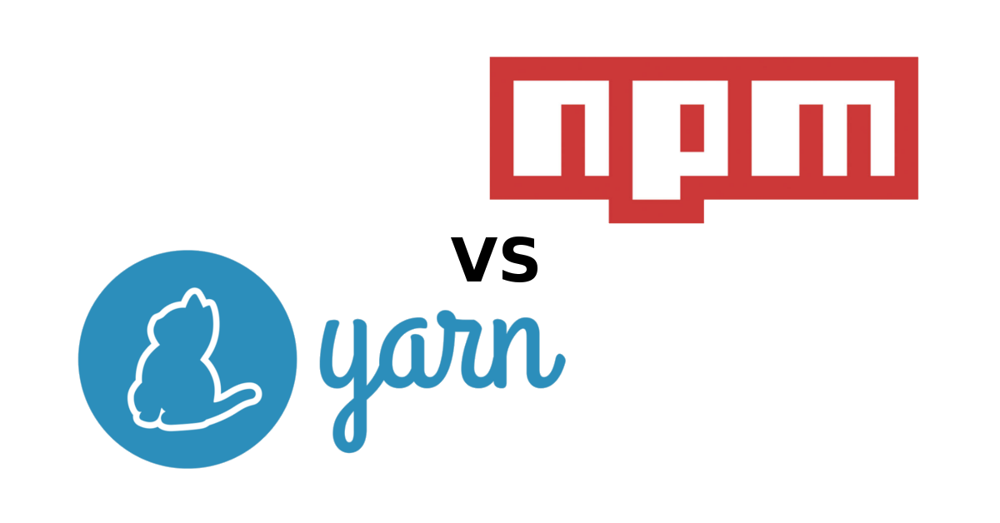

# Node.js Dojo

Welcome to this Node.js dojo, or *NoJo*. In this tutorial, you will learn the basics of Node and explore its applications in developing scalable network applications. You will learn what Node really is, including its asynchronous event capabilities, how modules enable clean encapsulation and you will even create a basic chat application and web server that can handle multiple concurrent requests.


# Introduction

## Prerequisites

To follow along, you will need to install the following software on your local machine:

* [Node v8](https://nodejs.org/en/) (*which includes [npm](https://www.npmjs.com/get-npm)*)
* [Yarn](https://yarnpkg.com/en/) (*recommended for people in Bath due to proxy issues as an alternative to npm*)
* [Visual Studio Code](https://code.visualstudio.com/)

The tutorial also assumes:

* you understand basic JavaScript and have an awareness of [ES6](http://es6-features.org) features.
* you are working on Windows OS (*there are slight differences in the implementation of Node on Linux*).

## Setting up your environment

To start, create a directory in which to store the examples you will work with in this tutorial. Open up an instance of Command Prompt and paste the following (*replacing with a suitable directory of your choice if you wish*):

```bash
mkdir ".%HOMEPATH%/Projects/NodeJsDojo"
code ".%HOMEPATH%/Projects/NodeJsDojo"
```

You can press `Ctrl + '` to open up the integrated terminal in Visual Studio Code and use this for our commands. Pressing `Ctrl + \` splits the terminal into multiple sessions, whilst `Ctrl + Shift + '` opens a new terminal in the dropdown terminal list. You can close any unnecessary terminals by entering the command:
```bash
exit
```
More handy shortcuts can be found [here](https://code.visualstudio.com/docs/editor/integrated-terminal).

Now that you're familiar with the terminal in Visual Studio Code, you can check Node has been installed correctly by entering the command:
```bash
node --version
```
You should see a version number in the format of `v8.x.x`

# What actually is Node?

Put simply, Node is a free, open source, cross-platform server environment. It runs in a single thread, and uses non-blocking, asynchronous programming so it can handle multiple requests simultaneously via events. It is fundamentally a JavaScript runtime environment, but is a lot more than just JavaScript - there is also a lot of C++ and C behind the scenes!

Here is a general (simplified) layout of Node's architecture:


Node consists of 3 primary building blocks:
* **[V8](https://developers.google.com/v8/)** - Google's high-performance JavaScript engine, written in C++ and used in Google Chrome. It is effectively a VM that can be used to run JavaScript code. Node uses this by default, but it is possible to configure it to use Microsoft's ChakraCore engine that powers Edge instead (see [here](https://github.com/nodejs/node-chakracore) if you're interested).
* **[Libuv](https://libuv.org/)** - A high performance, cross platform evented I/O library written in C. In Node, an event loop is used to push callbacks to the runtime call stack so that asynchronous responses can be processed - more on this later.
* **[JS, C++](https://nodejs.org/en/docs/meta/topics/dependencies/)** - Other code libraries for HTTP parsing, handling DNS requests, cryptographic functions and file compression/decompression.

Another core part of Node is [npm](https://docs.npmjs.com/), or *node package manager*. Since a key functionality of Node is modularity, npm allows users to publish packages to a registry via a Command Line Interface (CLI) - this will be explored later.

To understand some of these concepts better, it's time to get coding!

## Node CLI and REPL

In the Visual Studio Code terminal, simply entering the command
```bash
node
```
will take you into Node's shell called **REPL**. REPL stands for Read-Eval-Print-Loop and allows you to experiment with Node commands. Entering the command
```bash
> .help
```
lists all of the available commands - try that now. Pressing the `Tab` key twice provides us with a list of available commands / autocomplete options. If you do that on an empty terminal line, you will get the list of properties on the `global` object in Node. Try pressing `Tab` twice after typing the following:
```bash
> var str = "foo";

undefined

> str.
```
Now you will see what is available on the *str* variable. You will also notice that the result of assigning the variable is printed (`undefined` in this case).

Press `Ctrl + C` twice (or `Ctrl + D`) to terminate the Node REPL.

## Running scripts in Node

On the left hand side of Visual Studio Code, create a new file called *custom-repl.js* and paste in the following code:
```javascript
const repl = require('repl');
let r = repl.start({
    ignoreUndefined: true
});
```

Run this script in Node by running the command
```bash
node custom-repl.js
```
in the terminal. The `repl` module allows you to create a custom REPL session. In this case undefined values will not be printed e.g. try running the command `var str = "foo";` once more). More information about starting custom REPL sessions can be found [here](https://nodejs.org/api/repl.html#repl_repl_start_options).

## Introduction to require and modules

Modules allow you to encapsulate related code into a single unit. A module has a 1 to 1 relationship with files on the file system and any module can be "required" by another module that needs it. `require` and `module` are modules themselves and are used for managing module dependencies. The `require` module itself provides the `require()` function used for loading in modules.

Type into the terminal:
```bash
> node -p "module"

Module {
  id: '[eval]',
  exports: {},
  parent: undefined,
  filename: 'C:\\Projects\\NodeJSDojo\\[eval]',
  loaded: false,
  children: [],
  paths:
   [ 'C:\\Projects\\NodeJSDojo\\node_modules',
     'C:\\Projects\\node_modules',
     'C:\\node_modules' ] }
```

The `-p` flag allows Node to evaluate a JavaScript string and print the result. So the above is equivalent to creating a JavaScript file e.g. *index.js* containing `console.log(module)` and running `node index.js`.

You should be able to see the module of the Node process run from the above command. Note that the module has a unique `id`, parent-child relationships to other modules (empty in this case) and a list of paths (since Node allows multiple ways of requiring a file).

You might be wondering where this `module` has come from? It's a property stored on the `global` object.

## The global object in Node

In Node, the top-level scope is not the global scope. In regular JavaScript, `var a = ...` in the top-level scope will define a global variable (not a recommended practice). But in Node, any top-level variables declared in a Node module will be local to that module. To allow for global variables, Node uses the `global` object.

For example, the `process` object on the `global` object allows Node to communicate with its running environment. Try running the following in terminal to see the versions of Node's dependencies:
```bash
> node -p "process.versions"

{ http_parser: '2.7.0',
  node: '8.9.4',
  v8: '6.1.534.50',
  ... }
```

Anything defined on the `global` object is available across all modules e.g. `global.foo = "bar"`. That said, there is an exception to this rule...

## Wrapping modules

There are 5 variables on the `global` object that appear to be global when they are not:

* `__dirname`   - The directory name of the current module
* `__filename`  - The file name of the current module
* `exports`     - A reference to the module.exports that is shorter to type
* `module`      - A reference to the current module
* `require()`   - Used to require modules

This is because when Node compiles a module, it wraps the code in a wrapper function. You can inspect the wrapper function used for a general module by running the following command in the terminal:
```bash
> node -p "require('module').wrapper"

[ '(function (exports, require, module, __filename, __dirname) { ',
  '\n});' ]
```

It should be noted that `exports` is a convenience variable that simply refers to `module.exports`. The `module.exports` object is used for defining what a module exports and makes available through the `require()` method. In the following few lines of code we can see that the `exports` object can be used to export properties (but should not be replaced), whereas the entire object for `module.exports` *can* be replaced:

```javascript
exports.foo = 1;       // okay
module.exports = { foo: 1 };  // okay
exports = { id: 1 };  // avoid as exports no longer refers to module.exports
```

Taking a step back, it's important to understand requiring and exporting modules in Node. Let's look at a practical example - a HTTP server.

## A basic HTTP server

Create a folder called "modules" and add the following JavaScript file:
```javascript
// server.js
const server = require('http').createServer();

server.on('request', (req, res) => {
    res.end('Hello world\n');
}).listen(8000);
```

This code snippet creates a basic HTTP server that can accept requests, and respond with "Hello world". Run the server by running `node server.js` in the terminal. If you open up a browser session and visit `http://localhost:8000`, you will see the response printed. To modularize this code, add to the bottom of the code:
```javascript
module.exports = server;
```

Now, in a separate Javascript file `main.js` add the following code:
```javascript
// main.js
const server = require('./server');
```

If you run `node modules/main.js` in the terminal, you will be able to access the server in the browser as before in the same way. Notice you didn't need to use the file extension.

Try adding the line
```javascript
console.log(module);
```

to `main.js` and you will see, when running the Node application again, the module has children now (recall that this *module* is an argument of the wrapper function for the module encapsulated in `main.js`):

```bash
Module {
  id: '.',
  exports: {},
  parent: null,
  filename: 'C:\\Projects\\NodeJSDojo\\modules\\main.js',
  loaded: false,
  children:
   [ Module {
       id: 'C:\\Projects\\NodeJSDojo\\modules\\server.js',
       exports: [Object],
       parent: [Circular],
       filename: 'C:\\Projects\\NodeJSDojo\\modules\\server.js',
       loaded: true,
       children: [],
       paths: [Array] } ],
  paths:
   [ 'C:\\Projects\\NodeJSDojo\\modules\\node_modules',
     'C:\\Projects\\NodeJSDojo\\node_modules',
     'C:\\Projects\\node_modules',
     'C:\\node_modules' ] }
```

## Circular references

You may have noticed above that the parent property of the server module was printed as *[Circular]*. In this case, it is to stop Node recursively printing the same parent-child relationships again and again, but it should be noted that Node does actually support circular dependencies. The *loaded* boolean of the Module describes if all of the code from that module has been run yet - in the previous example, the server code had been fully run whereas the main code had not.

This raises an important question. If not all the code from one module has loaded, then what happens if you create a circular dependency? To explore this, create a `moduleA.js` file with this:

```javascript
// circularModuleA.js
exports.loadedValue = 123;
const mB = require('./circularModuleB');
exports.notLoadedValue = 42;
```

and create the following `circularModuleB.js` file:
```javascript
// circularModuleB.js
const mA = require('./circularModuleA');
console.log(mA.loadedValue);
console.log(mA.notLoadedValue);
```

If you run `node moduleA.js`, you will see that `123` and `undefined` are logged to the console. Node will share a partial exports object to any module that requires it in the case of a circular dependencies.

## The event queue, event loop and call stack

Node is described as "*an asynchronous event driven JavaScript runtime*". So far, you've seen one example of a Node event in the server example:

```javascript
server.on('request', (req, res) => {
    res.end('Hello world\n');
}).listen(8000);
```

But how do events like this work in Node? As you saw earlier in the architecture of Node, events are handled by Libuv via an *event loop* and *event queue*. The V8 *call stack* is a [LIFO](https://en.wikipedia.org/wiki/Stack_(abstract_data_type)) list of functions to be executed. The *event queue* contains a list of events with an associated function to be invoked when it is triggered. The job of the *event loop* is to monitor the *call stack* and *event queue* so that, if the *call stack* is empty, and the *event queue* is not, the last function will get pushed from the queue to be invoked in the call stack.

When running an asynchronous function on a timer or waiting on a response, Node uses its API (e.g. timers, emitters, wrappers around OS operations) to handle pushing items on to the *event queue* when needed.

Let's explore this. Create a folder called `event-loop` containing the following JavaScript file:
```javascript
// messageLogger.js
const logMessageWithDelay = (delay, msg, callback) => {
    setTimeout(() => {
        console.log(msg);
        if(callback) callback();
    }, delay);
};

for (let i=0; i<5; i++) {
    logMessageWithDelay(i*1000, "Message: ".concat(i));
};
```

Run this in the terminal by running `node event-loop/messageLogger.js` and you should see a message printed every second for 5 seconds. The `setTimeout` function schedules execution of a one-time callback after a delay (in ms). It's important to remember that `setTimeout` is not actually part of V8 - it's an API provided by Node (the browser equivalent is `window.setTimeout` from the JavaScript API). The following diagram describes what happens between the *call stack* and *event queue* as these messages are logged:


As soon as functions are invoked, they are popped off of the call stack. So `setTimeout`, `logMessageWithDelay` and (after the rest of the `logMessageWithDelay` functions have been invoked), `anonymous` are popped off of the *call stack*. When the `setTimeout` API is called, Node instantiates a timer outside of the V8 JavaScript run time which, after completion, pushes the callback to the *event queue*. As soon as the event is in the queue and the *call stack* is empty, the *event loop* on its next iteration will push the callback to the *call stack* to be invoked.

By default, when the *event loop* and *event queue* is empty, Node will exit the process.

## Inside the event loop

Other than `setTimeout`, Node also has the functions `setImmediate` and `setInterval` for scheduling callback execution. Create a new file in the `event-loop` folder with the following code:

```javascript
// setTimeout-vs-setImmediate.js
const fs = require('fs');

setTimeout(() => {
  console.log('timeout 1');
}, 0);

setImmediate(() => {
  console.log('immediate 1');
});

fs.readFile(__filename, () => {
  setTimeout(() => {
    console.log('timeout 2');
  }, 0);
  setImmediate(() => {
    console.log('immediate 2');
  });
});
```

The `readFile` method of the File System (`fs`) module can be used to asynchronously read the entire contents of a file. Recall that `__filename` refers to the file name of the current module.

Which of these do you think will be displayed first?

In this case, `immediate 2` will be logged before `timeout 2`, and the order of `immediate 1` and `timeout 1` is non-deterministic (run a few times and you will see different orders). To understand this, let's investigate the event loop inner workings. The following [diagram from the Node website](https://nodejs.org/en/docs/guides/event-loop-timers-and-nexttick/) gives a simplified overview of the event loop's order of operations to decide which events to push to the event queue and when:

```
   ┌───────────────────────────┐
┌─>│           timers          │
│  └─────────────┬─────────────┘
│  ┌─────────────┴─────────────┐
│  │     pending callbacks     │
│  └─────────────┬─────────────┘
│  ┌─────────────┴─────────────┐
│  │       idle, prepare       │
│  └─────────────┬─────────────┘      ┌───────────────┐
│  ┌─────────────┴─────────────┐      │   incoming:   │
│  │           poll            │<─────┤  connections, │
│  └─────────────┬─────────────┘      │   data, etc.  │
│  ┌─────────────┴─────────────┐      └───────────────┘
│  │           check           │
│  └─────────────┬─────────────┘
│  ┌─────────────┴─────────────┐
└──┤      close callbacks      │
   └───────────────────────────┘
```

On every iteration, Node executes the following phases:

* **timers**: this phase executes callbacks scheduled by `setTimeout()` and `setInterval()`.
* **pending callbacks**: executes I/O callbacks deferred to the next loop iteration.
* **idle, prepare**: only used internally.
* **poll**: retrieve new I/O events; execute I/O related callbacks (almost all with the exception of close callbacks, the ones scheduled by timers, and `setImmediate()`); Node will block here when appropriate.
* **check**: `setImmediate()` callbacks are invoked here.
* **close callbacks**: some close callbacks, e.g. `socket.on('close', ...)`.

`setImmediate` is designed to execute a script once the current *poll* phase completes. `setTimeout` schedules a script to be run after a minmium threshold in ms has elapsed (note the use of the word minimum; the exact timing is not guaranteed).

The main advantage to using `setImmediate` over `setTimeout` is `setImmediate` will always be executed before any timers if scheduled within an I/O cycle, independently of how many timers are present. So in the previous example, we were reading a file so `setImmediate` was called first in that case. It's always recommended to use `setImmediate` if you want something to be executed on the next iteration (*tick*) of the event loop. Confusingly enough, there is also a `process.nextTick` method that does not execute on the next iteration of the event loop. It is actually processed independently of the phases in the event loop, after the current operation finishes and before the event loop continues - it should be used with caution.

# Creating a chat application

In this section, you will explore how to use events to implement a chat application that users can simultaneously message each other on.

Start by creating a folder called `chat` and create the following JavaScript file:

```javascript
// server.js
const net = require('net');
```

The `net` module provides a way of creating TCP servers and TCP clients (*Transmission Control Protocol*). Recall that TCP works by streaming packets of data where rigorous checking and acknowledgement of delivery ensure reliable data (a brief summary of UDP vs TCP can be found [here](https://support.holmsecurity.com/hc/en-us/articles/212963869)).

The `createServer` method can be used to create the TCP server. Add the following to code to create a server listening on port 1337:

```javascript
const server = net.createServer();
server.listen(1337);
```

## Events

The `Server` is an instance of `EventEmitter`. This is a class within Node which is returned by the `events` module i.e. `const EventEmitter = require('events');`. Listeners (also extending `EventEmitter`) can listen for events and fire a callback, as well as emit events themselves. Add the following code to add a listener for the `connection` event which is fired whenever a client connects to the server.

```javascript
server.on('connection', socket => {
    console.log('Client connected');
    socket.write('Hello!\n');
});
```

A socket is one endpoint of a two-way communication link between two programs running on the network (so in this case, a client socket connecting to the server). To test this code, press `Ctrl + \` to split the terminal in Visual Studio Code. In one session, run the command:
```bash
node .\chat\server.js
```
In the other, run:
```bash
telnet localhost 1337
```
You should see `Hello!` is displayed in the client terminal session, and `Client connected` in the server terminal session. To exit the Telnet session press `Ctrl + ]` and type `quit`, and press `Ctrl + C` for the Node session.

Let's listen for the 'end' event so we can also add logging for when a client disconnects. You can also shorten the instantiation of the server so that a listener for the `connection` event is also added. The `listen` method also accepts a callback for its second parameter to fire on the `listening` event (emitted when the server has been bound to the listening port). Replace the server code with the following:

```javascript
// server.js
const server = require('net')
.createServer(socket => {
    console.log('Client connected');
    socket.write('Hello!\n');
    socket.on('end', () => {
        console.log('Client disconnected');
    });
})
.listen(1337, () => {
    console.log('Server bound');
});
```
Now when running the Node and Telnet sessions you will notice the additional logging and handling of the `end` event when disconnecting the client socket.

## NPM / Yarn and installing packages

Telnet is somewhat limited as the Windows version tries to send data for each character, making it difficult to work with sending full string chat messages (the Linux version supports linemode, allowing the user to send one line at a time). To combat this, and to learn about the *node package manager* (npm), let's download a package from Node's package registry.



Npm consists of the [npm registry](https://npmjs.com) and the corresponding command-line tool, which is distributed with Node.js. The registry contains over 600,000 packages which provide open-source modules that can be used in your applications. Yarn is an alternative package manager command-line tool developed by Facebook which was designed to address some initial issues with the way npm handles dependencies, whilst still making use of the npm registry. Both tools are similar and an in-depth discussion of which to use can be found [here](https://www.keycdn.com/blog/npm-vs-yarn/).

**Note:** Both the equivalent npm and Yarn commands are provided in any code snippets (but obviously avoid running both). If you have any proxy issues that are causing issues downloading the package, try using CNTLM in combination with changing your package manager's proxy settings - see the Appendix at the end for more details.

Quit any running terminal processes and run the following:
```bash
npm install netcat

yarn add netcat
```

A shorter version of the install command is `npm i ...`. From this command, the *netcat* package has been installed locally. [Netcat](https://en.wikipedia.org/wiki/Netcat) is a computer networking utility for reading from and writing to network connections using TCP or UDP. The *netcat* package can be used to implement Netcat-like functionality in Node.js, which we'll need for our chat application.

## What is a package?

The package install command installs a package, and any packages that it depends upon. But, what exactly constitutes a package? According to the [npm documentation](https://docs.npmjs.com/cli/install), a package is any one of the following:
* a folder (or git url resolving to one) containing a program described by a *package.json* file
* a gzipped tarball (or url resolving to one), containing the previous point
* a file published on the npm registry

When a package is installed locally, as in the previous example, a local `node_modules` folder is created in the project directory containing the required files. Looking in the project directory for this dojo, you will see that a `package.json` file has been created. Open it up and you will see the following (or similar depending on the latest package version):

```json
{
  "dependencies": {
    "netcat": "^1.3.5"
  }
}
```

## Publishing packages

If we wanted to [publish](https://docs.npmjs.com/cli/publish) our package to the registry, we would need to supply (as a minimum) a unique name and version not already in the registry being published to (the public npm registry by default). Here's an example of a `package.json` file with more complete metadata:

```json
{
    "name" : "nodejs-dojo",
    "version" : "0.0.1",
    "author" : "Keian Barton",
    "description" : "A cool module!",
    "keywords" : ["cool", "awesome"],
    "repository": {
        "type" : "git",
        "url" : "https://github.com/KeianBarton/xxxxx.git"
    },
    "dependencies" : {
        "netcat": "^1.3.5"
    },
    "main" : "app/main.js"
}
```

`main` defines the entry point to the module - the file used when someone requires your module.

## Global packages

We can also install global packages that are not project-dependent. As an example, we can install a specific version of the Angular CLI which can be used from the command line, and then remove it:

```bash
npm install -g @angular/cli@1.0.0
ng --version
npm uninstall -g @angular/cli@1.0.0

yarn global add @angular/cli@1.0.0
ng --version
yarn global remove @angular/cli@1.0.0
```

## Versioning packages

[Semantic versioning](https://docs.npmjs.com/misc/semver) is used to identify the version, or valid range of versions, that a package and/or its dependencies can have. For example "`<2.9.0`" refers to versions less than 2.9.0. In the following example, the corresponding package has developer dependencies and optional dependencies installed with `npm i -D ...` and `npm i -O ...` respectively. By looking up the semantic versioning documentation, can you understand which versions are valid in this package?

```json
{
    "name": "fun-package",
    "version": "1.0.0",
    "dependencies": {
        "moment": "~2.22.1"
    },
    "devDependencies": {
        "faker": "4.1.x"
    },
    "optionalDependencies": {
        "commander": "^2.15.0"
    }
}
```

One final thing to note about packages is that we can update all our installed packages to their latest versions by simply using the command:

```bash
npm update

yarn upgrade
```

## Integrating netcat into the chat application

Now that `netcat` has been installed, it's time to use it in the application. Create a new JavaScript file as follows:

```javascript
// client.js
const NetCatClient = require('netcat/client');
const readline = require('readline');

const client = new NetCatClient();

const rl = readline.createInterface({
    input: process.stdin
});

client.on('data', (data) => {
    process.stdout.write(data);
});

rl.on('line', (line) => {
    client.send(line);
});

client.addr('localhost').port(1337).connect();
```

As mentioned previously, the `netcat` module can be used to create TCP applications, allowing us to connect to the TCP server. The [`readline` module](https://nodejs.org/api/readline.html), supplied with Node, provides an interface from reading data from a readable stream, one line at a time. The above code creates a client that connects to the server, then listens for the `data` event from the server to write to the client's command line. If the client writes a line of data and ends the line (e.g. by pressing Enter), then we listen for the `line` event to send that data across to the server.

## Introduction to streams

The previous code snippet introduced `process.stdin` and `process.stdout` used for reading from and writing to the console respectively (indeed `console.log(...)` in Node writes to `process.stdout` but with a newline at the end). These are examples of streams.

Streams are essentially collections of data that might not be available all at once and do not have to be stored entirely in memory. They are instances of (and extensions to) the `EventEmitter` class, with an interface for receiving and writing data.

One example for using streams might be if you would like to read data from a massive file in chunks, without needing to load the entire file into memory (which might end up blocking other code). Try creating a separate folder containing a large text file and the following JavaScript file:

```javascript
// stream-file-efficient.js
const fs = require('fs');
const stream = fs.createReadStream('./data.txt');

stream.on('data', (data) => {
    console.log(data.toString());
})
```

The above code, when executing, would take up less memory than the following code (which could make a real performance difference for large files):
```javascript
// stream-file-inefficient.js
const fs = require('fs');
fs.readFile('./data.txt', (err, data) => {
  if (err) throw err;
  console.log(data.toString());
});
```

## Types of streams

There are four types of streams:
* [Readable](https://nodejs.org/api/stream.html#stream_readable_streams)
* [Writable](https://nodejs.org/api/stream.html#stream_writable_streams)
* [Duplex](https://nodejs.org/api/stream.html#stream_duplex_and_transform_streams)
* [Transform](https://nodejs.org/api/stream.html#stream_duplex_and_transform_streams)

Readable streams are an abstraction for a *source* from which data is consumed. Writable streams are an abstraction for a *destination* to which data is written. Duplex streams are both readable and writable. Transform streams are duplex streams that can transfomr data as it's written/read.

We can pipe data from a readable stream `src` to a writeable stream `dst`.
```javascript
src.pipe(dst);
```

The following example pipes effectively copies one text file to another, whilst using a transform stream to report progress for the copying process (by writing to `process.stdout`. Try running this code with a particularly big text file for `file1.txt` and observe the output:

```javascript
// file-copy-streams.js
const fs = require('fs');
const { Transform } = require('stream');

const progress = new Transform({
    transform(chunk, encoding, callback) {
        process.stdout.write('.');
        callback(null, chunk);
    }
});

fs.createReadStream('./file1.txt')
    .pipe(progress)
    .pipe(fs.createWriteStream('./file2.txt'));
```

## Understanding our client code

Back to our client code, we can see that we use streams to receive input data from `process.stdin` and output it to the server. Any received data is written to `process.stdout`. One thing to notice in the code is how we haven't defined the `readline` interface using an output to `process.stdout` - this would create a bug whereby any data received from the server would be output to the command line, which would be read back in and sent to the server and looped back and forth:

```javascript
// client.js
const NetCatClient = require('netcat/client');
const readline = require('readline');

const client = new NetCatClient();

const rl = readline.createInterface({
    input: process.stdin
});

client.on('data', (data) => {
    process.stdout.write(data);
});

rl.on('line', (line) => {
    client.send(line);
});

client.addr('localhost').port(1337).connect();
```

## Allowing users to message each other

Let's build on our server code so that multiple users can message each other.

Replace the server code with the following and try running 2 instances of `client.js` alongside `server.js` simultaneously:

```javascript
// server.js
const server = require('net')
.createServer(socket => {
    console.log('Client connected');
    socket.on('data', (data) => {
        console.log(data);
        socket.write(data);
    });
    socket.on('end', () => {
        console.log('Client disconnected');
    });
})
.listen(1337, () => {
    console.log('Server bound');
});
```

There are a number of issues with the code we have so far:
1. The message is logged as a Buffer object in the server, instead of a string. Messaging also may appear to be glitchy without clear end of lines.
2. You should see that when either user sends a message, it is logged in the server process, but neither user can see each other's messages.
3. Exiting a client session crashes the server.

Let's solve these problems:
1. Streaming messages correctly...

[Buffer](https://nodejs.org/api/buffer.html) objects in Node are used for reading and manipulating streams of binary data. We can call the `toString()` method on such Buffer objects to convert them to their string equivalent for correct logging. Ensuring we pass the new line character ensures that each messages takes up a line when received by the client (which otherwise may cause the received data to leak into any new messages). Amend the server code as follows:

```javascript
socket.on('data', (data) => {
    let msg = data.toString();
    console.log(msg);
    socket.write(`${msg}\n`);
});
```

2. Ensuring other users receive messages...

Define an array to hold our sockets and write any received message to each socket (other than the one writing the data). Give this a go and then make sure your code lines up like this one:
```javascript
// server.js
let sockets = [];

const server = require('net')
.createServer(socket => {
    sockets.push(socket);
    console.log('Client connected');

    socket.on('data', (data) => {
        let msg = data.toString();
        console.log(msg);
        sockets.forEach( (s) => {
            if (s !== socket) s.write(`${msg}\n`);
        });
    });

    socket.on('end', () => {
        sockets.splice(sockets.indexOf(socket), 1);
        console.log('Client disconnected');
    });
})
.listen(1337, () => {
    console.log('Server bound');
});
```

3. Clients disconnecting crashes the server

TCP servers require clients to send a final message to close the connection. Since we are exiting our clients by pressing CTRL + C, the exit is immediate and the server never receives a message that the message is closed. Add the following to the bottom of your client code:

```javascript
process.on('SIGINT', () => {
    client.close(() => { process.exit(); });
});
``` 

## Improving our chat application

Your chat application should now work fundamentally, but it can be improved. The following code showcases how the code can be evolved to to allow for name entry, and only broadcasting to those users who have set a name. Read through, copy and have a play with the following code:

```javascript
// server.js
const PORT = 1337;
const sockets = [];

const server = require('net')
.createServer(socket => {
    sockets.push(socket);
    socket.write(`Welcome! What is your name?\n`);

    socket.on('data', data => {
        let msg = data.toString().trim();
        if (msg !== '') {
            if (!socket.name) {
                socket.name = data;
                broadcast(`(${timestamp()}) ${socket.name} connected`);
            } else {
                broadcast(`(${timestamp()}) ${socket.name} : ${msg}`, socket);
            }
        }
    });

    socket.on('end', () => {
        let leaver = socket.name;
        sockets.splice(sockets.indexOf(socket), 1);
        if (leaver) {
            broadcast(`(${timestamp()}) ${leaver} disconnected`);
        }
    });
})
.listen(PORT, () => {
    console.log(`(${timestamp()}) Server bound on port ${PORT}`);
});

timestamp = () => {
    const now = new Date();
    return `${now.getHours()}:${now.getMinutes()}`;
};

broadcast = (message, sender) => {
    sockets.forEach( (socket) => {
        // Don't broadcast to senders / people starting app
        if (socket === sender || !socket.name) return;
        socket.write(`${message}\n`);
    });
    console.log(message);
};
```

For local networks, you should be able to connect to other user's servers using their external IP address (you can find your IP address by typing `ipconfig` into CMD) and connecting your client to e.g. `xxx.xxx.xxx.xxx:1337`.

There are two final improvements that we will make to our chat application:

1. Removing hardcoded connection information
2. Making better, more reliable, timestamps using Moment.js

For both of these we will make use of module requiring.

## Overview on requiring modules

You have already used basic requiring for importing modules. Recall that the `require` function is available on the global object as a reference to the current module's own `require()` function (which is stored in the module wrapper function arguments).

The `require` function can be overwritten if we didn't want to return the module exports object, which might be useful for testing purposes e.g. mocking out a module:

```javascript
// overwrite-require.js
require = function() {
    return { name : "mocked module", val: 1 };
};

const fs = require('fs');
console.log(fs);  // the mocked module is returned
```

When requiring a module, Node will go through a series of steps to identify a module. It will look through the paths property of the module starting from the first path onwards looking to find the module file. Try adding the following files into a folder and observe the paths output:

```javascript
// main.js
const w = require('example');
console.log(w.paths);

// example.js
module.exports = module;
```

For non-core modules and not already identified modules, Node will look in the current directory for any files matching the name and look up parent directories to the root directory (thereafter throwing an error). Once a module has been resolved, Node will look to that module file path whenever it is needed. Even if we create another module with the same file name in a different directory, Node will use that file unless it is deleted, after which it will repeat this path searching process.

To resolve a file path, without executing that module, we can use the resolve method:
```javascript
const w = require.resolve('example');
```

## Requiring JS and non-JS files

The `require` function can also be used to load JSON and C++ files, as well as JavaScript files. To remove the repeated connection information from our chat application, let's store this information in a `config.json` file:

```json
{
    "ADDRESS" : "localhost",
    "PORT": 1337
}
```

Node would try to load `config.js` first, then `config.json` (and `config.node` [which can be compiled from a C++ file](https://nodejs.org/api/addons.html)).

Let's now change all references to our hardcoded address and port to make use of this JSON file:

```javascript
// server.js
const config = require('config');
const PORT = config.PORT;

// client.js
const ADDRESS = config.ADDRESS;
const PORT = config.PORT;
// ...
client.addr(ADDRESS).port(PORT).connect();
```

## Wrapping and caching modules

## Incorporating Moment.js

## Last thoughts on the chat application

You should now have a working chat application, in which we have covered a lot of Node concepts. That said, there are a few remaining issues in this application. If you finish the rest of the dojo early, see if you can improve the following:
* If user A starts typing a message and user B sends a message, user A's WIP message is lost.
* Add a way to exit the app more gracefully e.g. if the user types 'EXIT'.
* Add a command for a user to stream the contents of a text file to other users.

## Complete code

```javascript
// config.json
{
    "ADDRESS" : "localhost",
    "PORT": 1337
}

// server.js
const config = require('config');
const PORT = config.PORT;

const sockets = [];

const server = require('net')
.createServer(socket => {
    sockets.push(socket);
    socket.write(`Welcome! What is your name?\n`);

    socket.on('data', data => {
        let msg = data.toString().trim();
        if (msg !== '') {
            if (!socket.name) {
                socket.name = data;
                broadcast(`(${timestamp()}) ${socket.name} connected`);
            } else {
                broadcast(`(${timestamp()}) ${socket.name} : ${msg}`, socket);
            }
        }
    });

    socket.on('end', () => {
        let leaver = socket.name;
        sockets.splice(sockets.indexOf(socket), 1);
        if (leaver) {
            broadcast(`(${timestamp()}) ${leaver} disconnected`);
        }
    });
})
.listen(PORT, () => {
    console.log(`(${timestamp()}) Server bound on port ${PORT}`);
});

timestamp = () => {
    const now = new Date();
    return `${now.getHours()}:${now.getMinutes()}`;
};

broadcast = (message, sender) => {
    sockets.forEach( (socket) => {
        // Don't broadcast to senders / people starting app
        if (socket === sender || !socket.name) return;
        socket.write(`${message}\n`);
    });
    console.log(message);
};

// client.js
const NetCatClient = require('netcat/client');
const readline = require('readline');
const config = require('config');

const ADDRESS = config.ADDRESS;
const PORT = config.PORT;

const client = new NetCatClient();

const rl = readline.createInterface({
    input: process.stdin
});

client.on('data', (data) => {
    process.stdout.write(data);
});

rl.on('line', (line) => {
    client.send(line);
});

client.addr(ADDRESS).port(PORT).connect();

process.on('SIGINT', () => {
    client.close(() => { process.exit(); });
});
```

## Installing moment for better timekeeping

## NPM and how to publish your own module

## Web server and making use of clusters

If time

# Appendix

## Proxy issues and CNTLM

Some users have had issues downloading and installing npm packages with the corporate proxy. Try using the following commands in combination with running CNTLM via the `start proxy` bat file. For the Bath office, this can be downloaded from `Y:\CloudVault\Pinky\Applications\Freeware\CNTLM` where the Y drive is mapped to `\\iplbath.com`.

```bash
npm config set proxy http://127.0.0.1:3128
npm config set https-proxy http://127.0.0.1:3128
npm config set registry "http://registry.npmjs.org/"

yarn config set proxy http://127.0.0.1:3128
yarn config set https-proxy http://127.0.0.1:3128
yarn config set registry "http://registry.npmjs.org/
```

## References

* https://medium.freecodecamp.org/node-js-module-exports-vs-exports-ec7e254d63ac
* https://app.pluralsight.com/player?course=nodejs-advanced
* https://app.pluralsight.com/library/courses/node-intro/table-of-contents
* https://nodejs.org/en/docs/guides/event-loop-timers-and-nexttick/
* https://support.holmsecurity.com/hc/en-us/articles/212963869
* https://gist.github.com/tedmiston/5935757
* https://docs.oracle.com/javase/tutorial/networking/sockets/definition.html
* https://gist.github.com/creationix/707146
* https://www.keycdn.com/blog/npm-vs-yarn/
* https://docs.npmjs.com/cli/install
* https://nodejs.org/api/stream.html
* https://www.sitepoint.com/basics-node-js-streams/
* https://nodejs.org/api/buffer.html
* https://nodejs.org/api/addons.html